# TicketHub - Event Ticket Booking System


TicketHub is a full-stack event ticket booking platform built with a Spring Boot backend and a React frontend. It supports event publishing, ticket purchasing, QR-code ticket generation, and ticket validation for event staff.

The project is backend-focused. The frontend is a client application that consumes the backend REST APIs.

---

## Features

### Backend

- Keycloak-based JWT authentication
- Role-based access for organizers and staff
- Automatic local user provisioning from JWT claims
- Organizer event CRUD
- Published event listing and search
- Ticket type creation and updates through event workflows
- Ticket purchase with capacity checks
- QR-code generation for purchased tickets
- Ticket listing and ticket detail APIs for attendees
- Manual and QR-code ticket validation
- Centralized exception handling
- PostgreSQL persistence with Spring Data JPA
- Docker Compose setup for PostgreSQL, Adminer, and Keycloak

### Frontend

- Public event browsing
- Keycloak login flow
- Attendee ticket pages
- Organizer event management pages
- Staff ticket validation page with QR scanning

---

## Tech Stack

| Layer | Technologies |
| --- | --- |
| Backend | Java 21, Spring Boot, Spring Web, Spring Security, OAuth2 Resource Server |
| Persistence | Spring Data JPA, Hibernate, PostgreSQL |
| Auth | Keycloak, JWT |
| Mapping / Validation | MapStruct, Jakarta Validation, Lombok |
| QR Codes | ZXing |
| Build | Maven |
| Frontend | React, TypeScript, Vite, React Router, Axios, TanStack Query |
| UI | Tailwind CSS, Radix UI |
| Local Infra | Docker Compose |

---

## Architecture

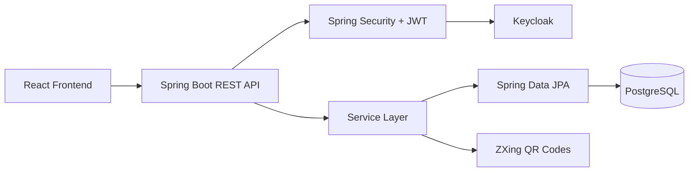

The backend follows a standard layered architecture:

- **Controllers** expose REST APIs.
- **Services** contain business logic.
- **Repositories** handle database access.
- **Entities** model events, ticket types, tickets, users, QR codes, and validations.
- **DTOs and mappers** separate API contracts from persistence models.

---

## Project Structure

```text
.
|-- backend/
|   |-- docker-compose.yml
|   |-- pom.xml
|   `-- src/main/java/com/devtiro/tickets/
|       |-- config/
|       |-- controllers/
|       |-- domain/
|       |-- exceptions/
|       |-- filters/
|       |-- mappers/
|       |-- repositories/
|       |-- services/
|       `-- util/
|-- frontend/
|   |-- package.json
|   `-- src/
|       |-- api/
|       |-- auth/
|       |-- components/
|       |-- pages/
|       `-- router/
`-- Images/
```

---

## Core Backend Modules

| Module | Purpose |
| --- | --- |
| Events | Organizer event creation, updates, listing, details, deletion, and public published event discovery |
| Ticket Types | Ticket categories with price, description, and availability |
| Tickets | Ticket purchase, attendee ticket listing, and ticket details |
| QR Codes | QR-code creation and PNG retrieval for purchased tickets |
| Validation | Ticket validation by QR scan or manual ticket ID |
| Security | JWT validation, role extraction, and local user provisioning |

---

## Security

The backend uses Spring Security as a stateless OAuth2 Resource Server.

- JWT issuer: `http://localhost:9090/realms/event-ticket-platform`
- Public endpoints: `GET /api/v1/published-events/**`
- Organizer access: `ROLE_ORGANIZER`
- Staff access: `ROLE_STAFF`
- Authenticated users are provisioned into the local `users` table from Keycloak claims.

Expected Keycloak realm roles:

```text
ROLE_ORGANIZER
ROLE_STAFF
```

---

## Database Model

Main entities:

| Entity | Description |
| --- | --- |
| `User` | Local user profile linked to Keycloak user ID |
| `Event` | Event owned by an organizer |
| `TicketType` | Purchasable ticket category for an event |
| `Ticket` | Purchased ticket owned by an attendee |
| `QrCode` | Active QR code linked to a ticket |
| `TicketValidation` | Validation attempt and result |

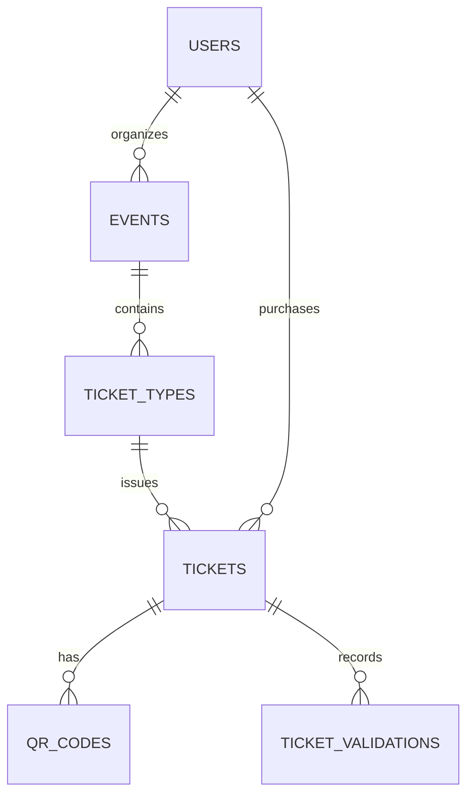

---

## REST APIs

Base path: `/api/v1`

### Events

| Method | Endpoint | Description |
| --- | --- | --- |
| `POST` | `/events` | Create organizer event |
| `GET` | `/events` | List organizer events |
| `GET` | `/events/{eventId}` | Get organizer event details |
| `PUT` | `/events/{eventId}` | Update organizer event |
| `DELETE` | `/events/{eventId}` | Delete organizer event |

### Published Events

| Method | Endpoint | Description |
| --- | --- | --- |
| `GET` | `/published-events` | List/search published events |
| `GET` | `/published-events/{eventId}` | Get published event details |

### Tickets

| Method | Endpoint | Description |
| --- | --- | --- |
| `POST` | `/events/{eventId}/ticket-types/{ticketTypeId}/tickets` | Purchase ticket |
| `GET` | `/tickets` | List authenticated user's tickets |
| `GET` | `/tickets/{ticketId}` | Get ticket details |
| `GET` | `/tickets/{ticketId}/qr-codes` | Get ticket QR code as PNG |

### Validation

| Method | Endpoint | Description |
| --- | --- | --- |
| `POST` | `/ticket-validations` | Validate ticket manually or by QR code |

---

## Configuration

Backend config file:

```text
backend/src/main/resources/application.properties
```

Important values:

```properties
spring.datasource.url=jdbc:postgresql://localhost:5433/postgres
spring.datasource.username=postgres
spring.datasource.password=sujal
spring.security.oauth2.resourceserver.jwt.issuer-uri=http://localhost:9090/realms/event-ticket-platform
```

Docker Compose exposes PostgreSQL on `5432`, while the checked-in Spring config uses `5433`. Update the datasource URL or Docker port before running locally.

---

## Running Locally

### Backend

```bash
cd backend
docker compose up -d
./mvnw spring-boot:run
```

Run backend tests:

```bash
cd backend
./mvnw test
```

### Frontend

```bash
cd frontend
npm install
npm run dev
```

Keycloak must be configured with:

- Realm: `event-ticket-platform`
- Client ID: `event-ticket-frontend`
- Roles: `ROLE_ORGANIZER`, `ROLE_STAFF`

---

## Screenshots

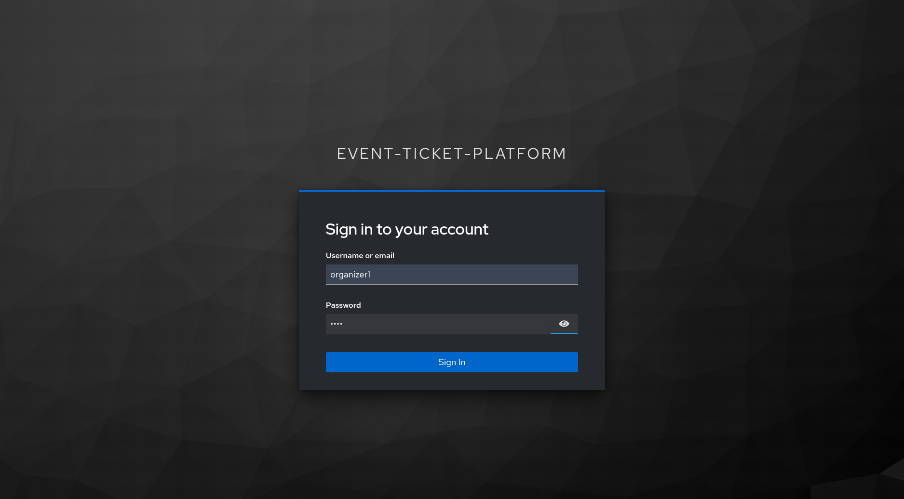
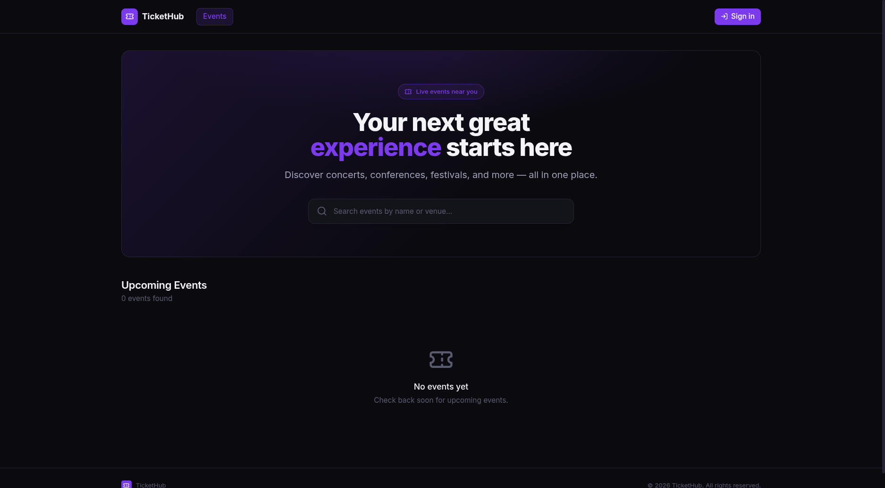
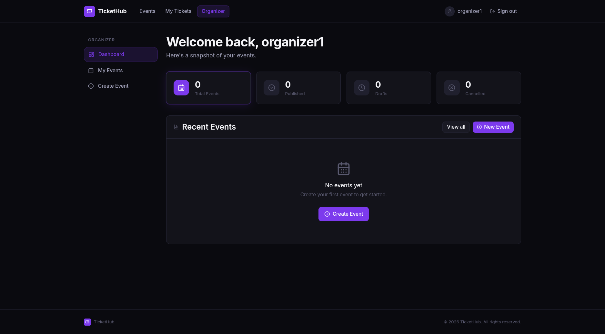
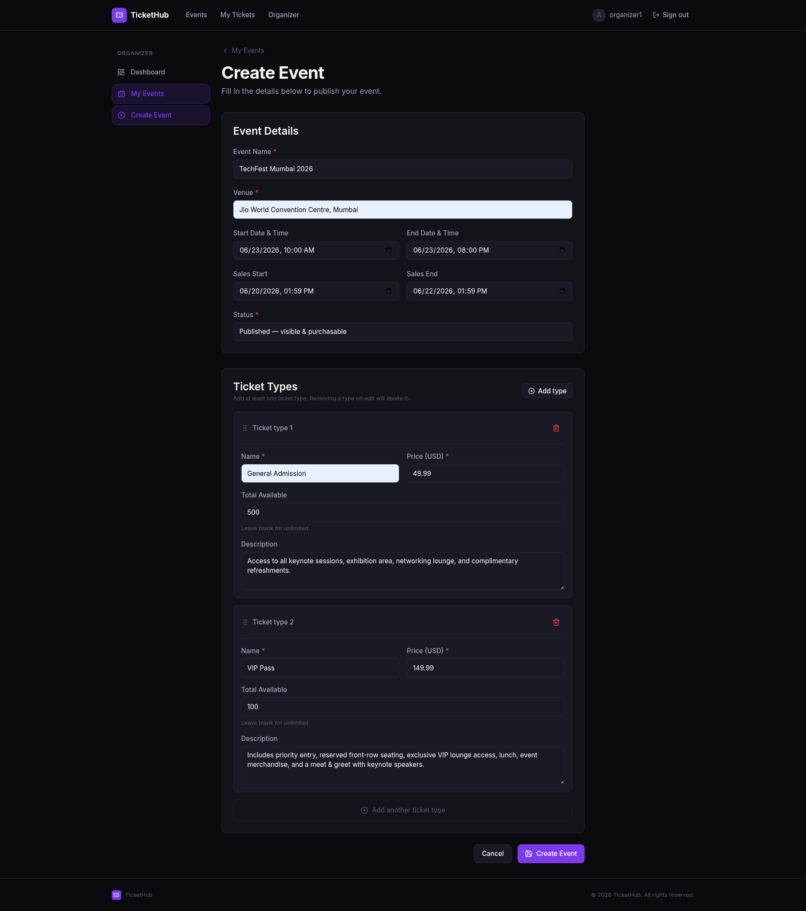
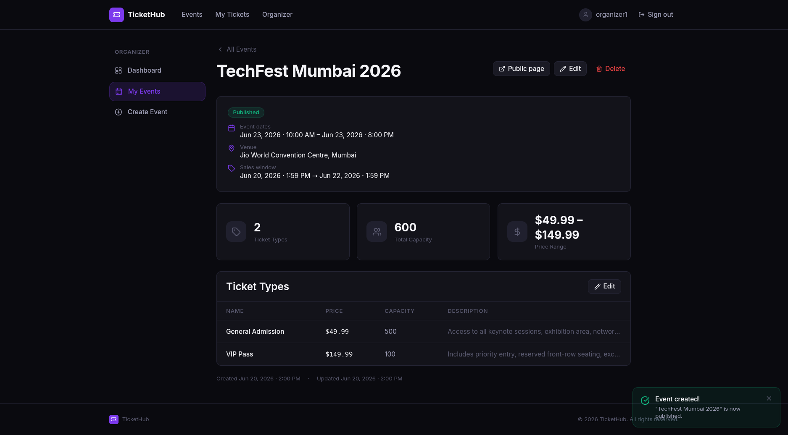
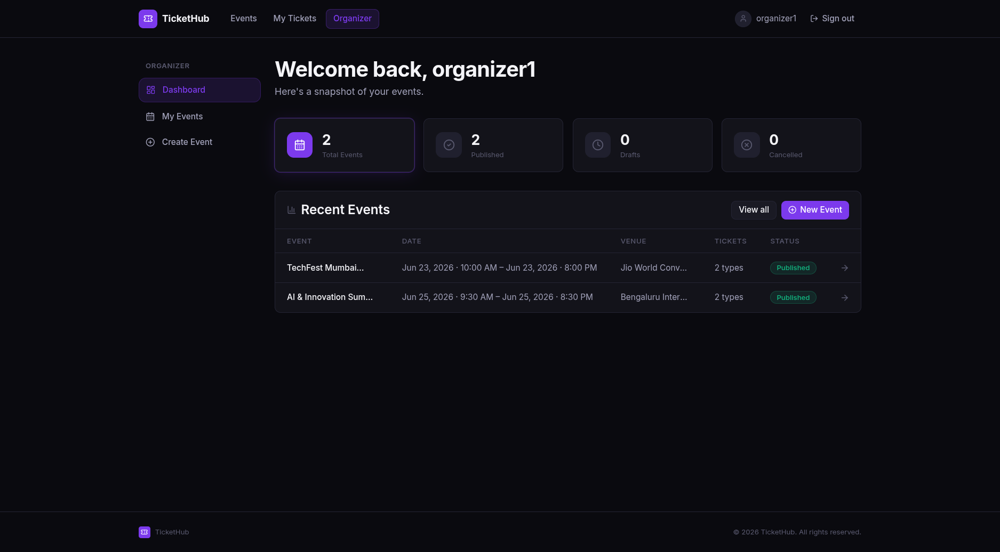

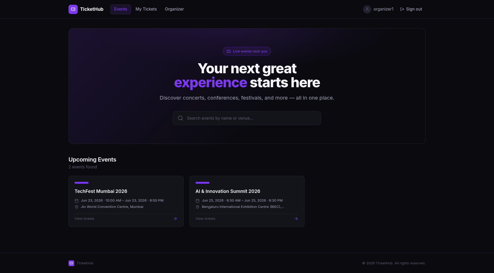
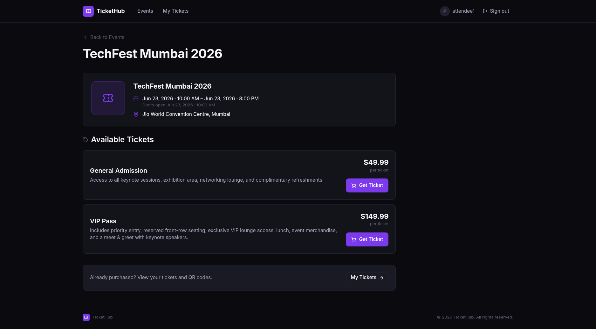
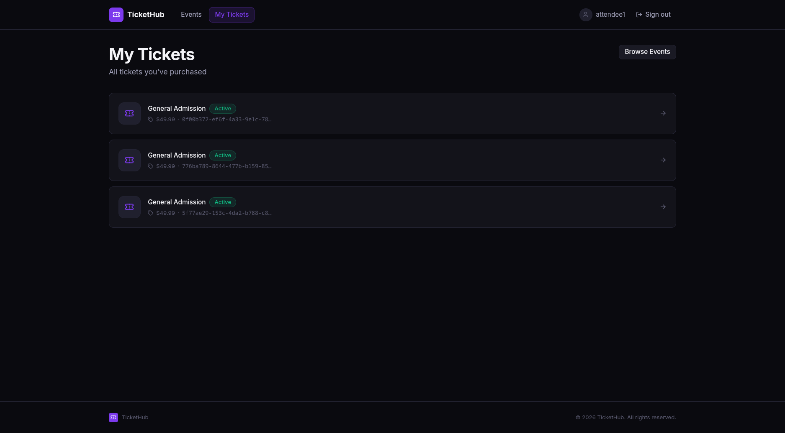
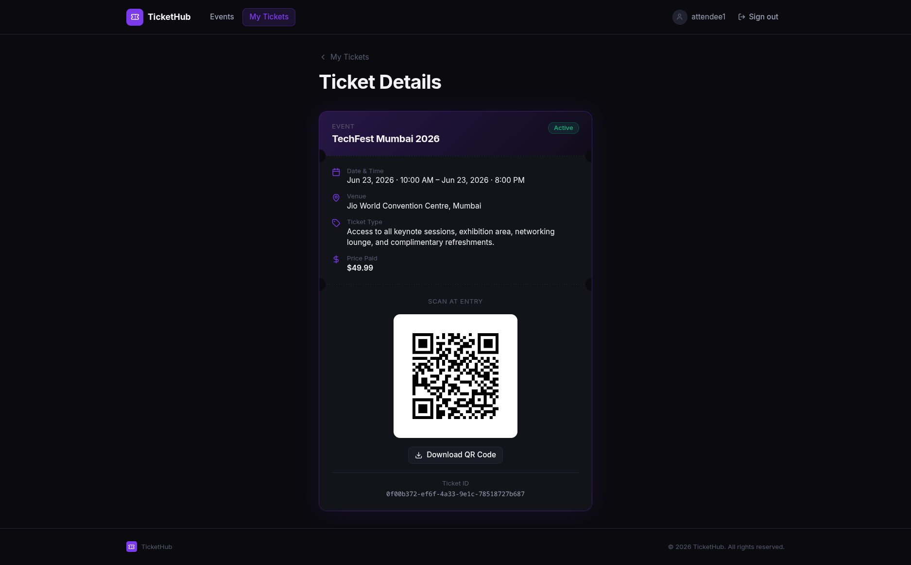
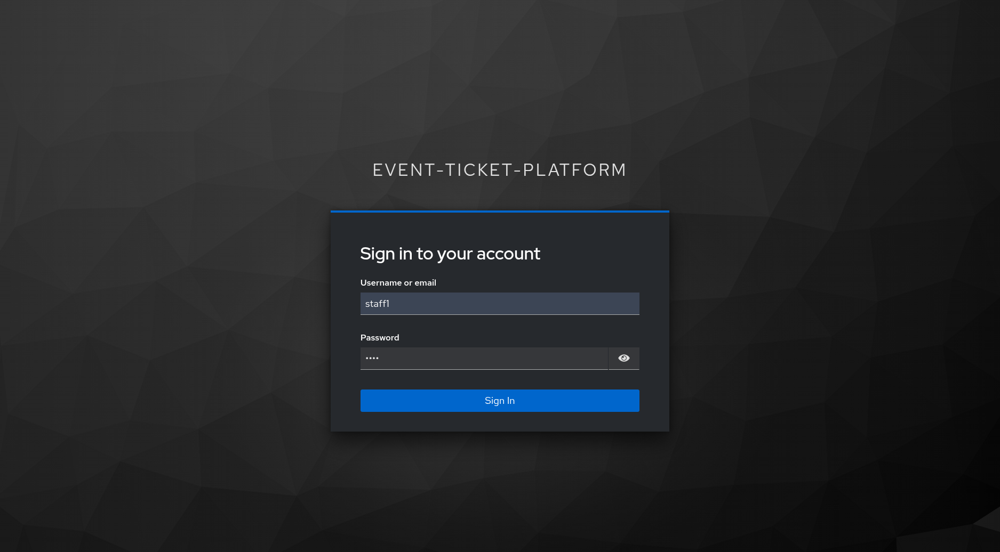
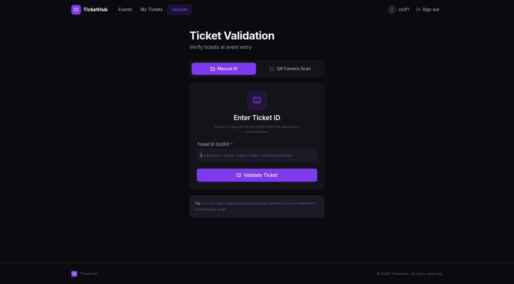
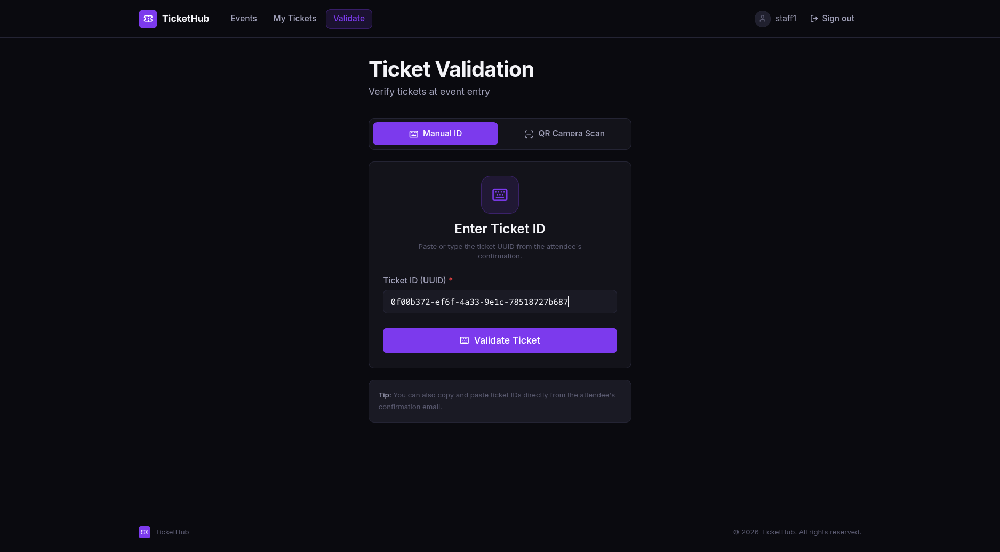
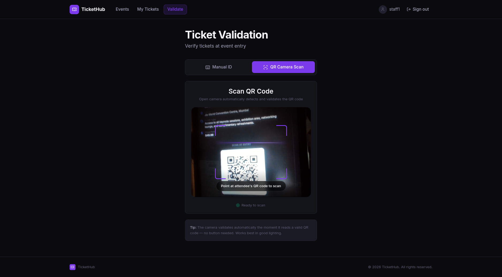
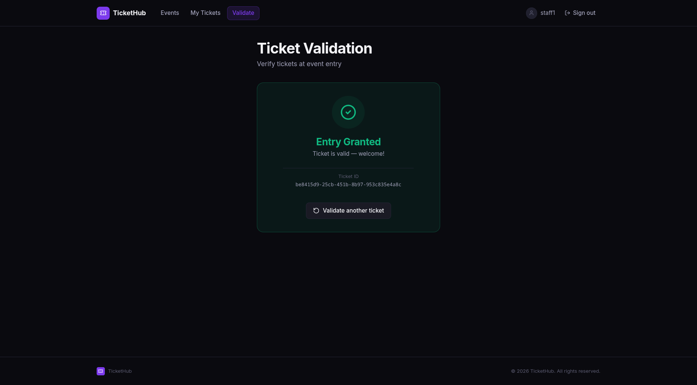
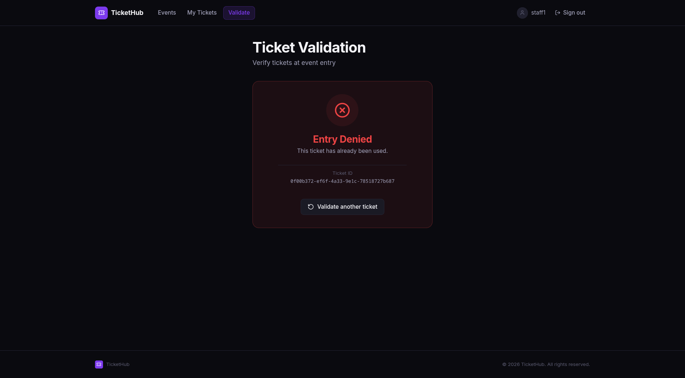
---

## Future Improvements

- Add Flyway or Liquibase migrations
- Move secrets and local URLs to environment variables
- Add OpenAPI documentation
- Add payment integration
- Add more integration tests for security and ticket purchase flows

---

## License

See `backend/LICENSE`.
